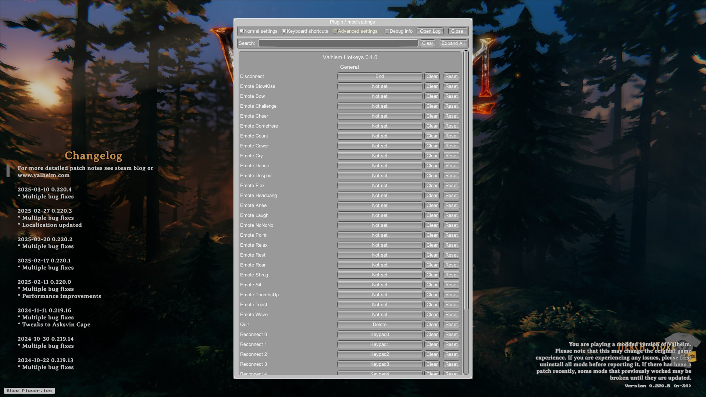

# valhiem-hotkeys

    

    Simple hotkeys for valhiem! <i>(>100 lines)</i>

 
 

### Features

- Emotes hotkeys
- Logout / Quit hotkeys
- Server reconnect hotkeys

### Installation

Ensure you have [Bepinex v5.4+](https://github.com/BepInEx/BepInEx/releases) installed with Valhiem.

1. Download the [latest release](https://github.com/ashnel3/valhiem-hotkeys/releases).
2. Extract into `Valhiem/Bepinex/plugins`.
3. Install a [ConfigurationManager](https://thunderstore.io/c/valheim/p/Azumatt/Official_BepInEx_ConfigurationManager) to customize your bindings. \*_(optional)_
